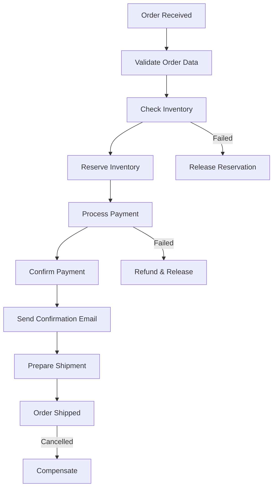

# NestJS Temporal Core Example

A production-ready NestJS application demonstrating the `nestjs-temporal-core` package for workflow orchestration. This example implements a complete order management system with compensation logic, real-time progress tracking, and fault tolerance.

## 🎯 Overview

This application showcases how to integrate Temporal.io with NestJS using the `nestjs-temporal-core` package, demonstrating:

- **Complete Order Workflow**: End-to-end order processing with inventory management, payment processing, and email notifications
- **Fault Tolerance**: Automatic retries, compensation logic, and graceful error handling
- **Real-time Tracking**: Signal and query patterns for workflow interaction
- **Production Patterns**: Proper activity timeouts, retry strategies, and state management
- **Local Development**: Uses `yalc` for local `nestjs-temporal-core` package development

## ✨ Features

- ✅ **Temporal Workflow Orchestration**: Durable execution with automatic retry and recovery
- ✅ **Activity Services**: Modular, testable activity implementations with NestJS DI
- ✅ **Signal & Query Patterns**: Real-time workflow interaction and status monitoring
- ✅ **Compensation Logic**: Automatic rollback on failures (refunds, inventory release)
- ✅ **REST API**: Full CRUD operations with Swagger documentation
- ✅ **Docker Compose**: Complete Temporal + PostgreSQL setup
- ✅ **Type Safety**: Full TypeScript support with interface contracts

## 🏗️ Architecture

### Core Components

```
src/
├── workflows/          # Pure Temporal workflow definitions
│   ├── order.workflow.ts    # Main order processing logic
│   └── index.ts             # Workflow exports
├── activities/         # NestJS services with @Activity decorator
│   ├── payment.activities.ts      # Payment processing & refunds
│   ├── inventory.activities.ts    # Inventory checks & reservations
│   ├── email.activities.ts        # Email notifications
│   └── notification.activities.ts # SMS/push notifications
├── services/           # Business logic layer
│   └── order.service.ts     # Workflow orchestration
├── controllers/        # REST API endpoints
│   └── order.controller.ts  # Order management endpoints
└── app.module.ts       # TemporalModule configuration
```

### Temporal Integration

The application uses `TemporalModule.registerAsync()` for configuration:

```typescript
TemporalModule.registerAsync({
  connection: {
    address: "localhost:7233",
    namespace: "default",
  },
  taskQueue: "order-processing",
  worker: {
    workflowsPath: require.resolve("./workflows"),
    activityClasses: [
      PaymentActivityService,
      InventoryActivityService,
      EmailActivityService,
      NotificationActivityService,
    ],
    autoStart: true,
  },
});
```

## 🚀 Quick Start

### Prerequisites

- **Node.js**: 18.x or higher
- **Docker & Docker Compose**: For Temporal server
- **npm**: Package manager

### 1. Clone and Install

```bash
# Clone the repository
git clone https://github.com/harsh-simform/nestjs-temporal-core-example.git
cd nestjs-temporal-core-example

# Install dependencies
npm install
```

### 2. Start Temporal Server

```bash
# Start Temporal + PostgreSQL with Docker Compose
npm run temporal:up
```

This starts:

- **Temporal Server**: `localhost:7233`
- **Temporal Web UI**: http://localhost:8088
- **PostgreSQL**: `localhost:5433` (port 5433 to avoid conflicts)

### 3. Configure Environment

Copy the example environment file:

```bash
cp .env.example .env
```

Default configuration (`.env`):

```env
# Application
NODE_ENV=development
PORT=3232

# Temporal (Local Development)
TEMPORAL_ADDRESS=localhost:7233
TEMPORAL_NAMESPACE=default
TEMPORAL_TASK_QUEUE=order-processing
```

> **Note**: For Temporal Cloud, see the `.env.example` file for TLS configuration options.

### 4. Start the Application

```bash
# Development mode with hot reload
npm run start:dev

# Production build
npm run build
npm start
```

### 5. Access the Application

- **REST API**: http://localhost:3232
- **Swagger UI**: http://localhost:3232/api
- **Temporal Web UI**: http://localhost:8088

## 📡 API Endpoints

### Order Management

| Method   | Endpoint                       | Description                     |
| -------- | ------------------------------ | ------------------------------- |
| `POST`   | `/orders`                      | Create a new order              |
| `POST`   | `/orders/demo`                 | Create a demo order for testing |
| `GET`    | `/orders/:workflowId/status`   | Get order status                |
| `GET`    | `/orders/:workflowId/progress` | Get order progress              |
| `DELETE` | `/orders/:workflowId`          | Cancel an order                 |
| `PATCH`  | `/orders/:workflowId`          | Update an order                 |
| `GET`    | `/orders`                      | List active orders              |

### Example Requests

#### Create a Demo Order

```bash
curl -X POST http://localhost:3232/orders/demo
```

**Response:**

```json
{
  "orderId": "ORD-1699564829123-ABC123XYZ",
  "workflowId": "order-workflow-ORD-1699564829123-ABC123XYZ",
  "message": "Demo order created successfully"
}
```

#### Create a Custom Order

```bash
curl -X POST http://localhost:3232/orders \
  -H "Content-Type: application/json" \
  -d '{
    "customerId": "customer-123",
    "customerEmail": "john@example.com",
    "customerName": "John Doe",
    "items": [
      {
        "productId": "product-1",
        "productName": "Widget",
        "quantity": 2,
        "price": 29.99
      }
    ],
    "shippingAddress": {
      "street": "123 Main St",
      "city": "San Francisco",
      "state": "CA",
      "zipCode": "94102",
      "country": "USA"
    },
    "paymentMethod": "credit_card"
  }'
```

#### Check Order Status

```bash
curl http://localhost:3232/orders/order-workflow-ORD-1699564829123-ABC123XYZ/status
```

**Response:**

```json
{
  "orderId": "ORD-1699564829123-ABC123XYZ",
  "status": "PAYMENT_CONFIRMED",
  "currentStep": "payment_confirmation",
  "paymentId": "pay_1699564835123_abc123",
  "reservationId": "rsv_1699564832123_xyz789",
  "trackingNumber": null,
  "cancellationReason": null,
  "errorMessage": null
}
```

#### Get Order Progress

```bash
curl http://localhost:3232/orders/order-workflow-ORD-1699564829123-ABC123XYZ/progress
```

**Response:**

```json
{
  "currentStep": "payment_confirmation",
  "completedSteps": [
    "order_validation",
    "inventory_check",
    "inventory_reservation",
    "payment_processing",
    "payment_confirmation"
  ],
  "totalSteps": 8,
  "percentComplete": 62.5,
  "status": "PAYMENT_CONFIRMED"
}
```

#### Cancel an Order

```bash
curl -X DELETE http://localhost:3232/orders/order-workflow-ORD-1699564829123-ABC123XYZ \
  -H "Content-Type: application/json" \
  -d '{"reason": "Customer requested cancellation"}'
```

## 🔄 Order Workflow Lifecycle

The order processing workflow consists of 8 steps:



### Step Details

1. **Order Validation** (5s): Validates order data and customer information
2. **Inventory Check** (3s): Verifies product availability
3. **Inventory Reservation** (2s): Reserves items for the order
4. **Payment Processing** (5s): Processes payment with retry logic (up to 5 attempts)
5. **Payment Confirmation** (3s): Confirms successful payment
6. **Order Confirmation** (2s): Sends email notifications
7. **Shipping Preparation** (4s): Prepares order for shipment
8. **Order Shipped** (1s): Generates tracking number and finalizes order

### Activity Timeouts & Retries

| Activity     | Timeout   | Max Retries | Retry Policy        |
| ------------ | --------- | ----------- | ------------------- |
| Payment      | 5 minutes | 5           | Exponential backoff |
| Inventory    | 1 minute  | 3           | Exponential backoff |
| Email        | 2 minutes | 3           | Exponential backoff |
| Notification | 2 minutes | 3           | Exponential backoff |

## 🛡️ Error Handling & Compensation

The workflow includes comprehensive error handling with automatic compensation:

### Failure Scenarios

**Inventory Unavailable**

```typescript
// Automatic compensation
- Release any partial reservations
- Update order status to FAILED
- Log failure reason
```

**Payment Failure**

```typescript
// Automatic compensation
- Refund any processed payments
- Release inventory reservations
- Update order status to FAILED
- Send failure notification
```

**Order Cancellation**

```typescript
// Signal-triggered compensation
- Refund payment (if processed)
- Release inventory reservations
- Update order status to CANCELLED
- Send cancellation notification
```

### Retry Strategy

Activities use exponential backoff with the following configuration:

```typescript
const paymentActivities = proxyActivities<PaymentActivities>({
  startToCloseTimeout: "5m",
  retry: {
    initialInterval: "1s",
    backoffCoefficient: 2,
    maximumInterval: "100s",
    maximumAttempts: 5,
  },
});
```

## 🎨 nestjs-temporal-core Decorators

This example demonstrates all available decorators from the package:

### Activity Decorators

**@Activity()** - Marks a class as a Temporal activity service

```typescript
@Injectable()
@Activity()
export class PaymentActivityService {
  // Activity methods here
}
```

**@ActivityMethod()** - Marks a method as an executable activity

```typescript
@ActivityMethod()
async processPayment(paymentData: PaymentData): Promise<PaymentResult> {
  // Implementation
}
```

### Workflow Patterns

**Signals** - Send external events to running workflows

```typescript
// Define signal in workflow
export const cancelOrderSignal = defineSignal<[string]>("cancelOrder");

// Send signal from service
await this.temporal.signalWorkflow(workflowId, "cancelOrder", [reason]);
```

**Queries** - Retrieve workflow state without affecting execution

```typescript
// Define query in workflow
export const getOrderStatusQuery = defineQuery<OrderStatus>("getOrderStatus");

// Query from service
const status = await this.temporal.queryWorkflow(workflowId, "getOrderStatus");
```

## 🔧 Development

### Available Scripts

```bash
# Development
npm run start:dev          # Start with hot reload
npm run start:debug        # Start with debugger

# Build
npm run build              # Compile TypeScript

# Docker
npm run temporal:up        # Start Temporal server
npm run temporal:down      # Stop Temporal server
npm run temporal:logs      # View Temporal logs

# Code Quality
npm run lint               # Lint TypeScript files
npm run format             # Format with Prettier
npm test                   # Run tests
```

### Project Structure

```
nestjs-temporal-core-example/
├── .env.example           # Environment template
├── docker-compose.yml     # Temporal + PostgreSQL setup
├── package.json           # Dependencies and scripts
├── tsconfig.json          # TypeScript configuration
└── src/
    ├── main.ts                   # Application entry point (port 3232)
    ├── app.module.ts             # Root module with TemporalModule config
    ├── workflows/
    │   ├── index.ts              # Workflow exports
    │   └── order.workflow.ts     # Order processing workflow
    ├── activities/
    │   ├── payment.activities.ts       # Payment & refund operations
    │   ├── inventory.activities.ts     # Inventory management
    │   ├── email.activities.ts         # Email notifications
    │   └── notification.activities.ts  # SMS/push notifications
    ├── services/
    │   └── order.service.ts      # Business logic layer
    └── controllers/
        └── order.controller.ts   # REST API endpoints
```

### Local Package Development

This project uses `yalc` for local `nestjs-temporal-core` development:

```bash
# In nestjs-temporal-core package directory
yalc publish

# In this project
yalc add nestjs-temporal-core
npm install
```

### Debugging Workflows

**Temporal Web UI** (http://localhost:8088):

- View workflow execution history
- Inspect event timeline
- Monitor activity performance
- Debug failures with stack traces

**Application Logs**:

```bash
# Watch application logs
npm run start:dev

# Watch Temporal server logs
npm run temporal:logs
```

## 📊 Monitoring & Observability

### Workflow Inspection

Use the Temporal Web UI to monitor:

1. **Workflow List**: All running and completed workflows
2. **Workflow Detail**: Complete event history and timeline
3. **Activity Status**: Individual activity executions and retries
4. **Stack Traces**: Debug failures with full stack traces
5. **Query Testing**: Test queries directly from the UI

### Real-time Progress Tracking

The workflow exposes progress information:

```typescript
interface OrderProgress {
  currentStep: string;
  completedSteps: string[];
  totalSteps: number;
  percentComplete: number;
  status: OrderStatusEnum;
}
```

### Health Checks

Monitor application and Temporal connectivity:

```bash
# Check application health
curl http://localhost:3232/health

# Check Temporal connectivity
curl http://localhost:3232/health/temporal
```

## 🧪 Testing

### Manual Testing with Demo Order

```bash
# 1. Start services
npm run temporal:up
npm run start:dev

# 2. Create test order
curl -X POST http://localhost:3232/orders/demo

# 3. Monitor in Temporal UI
# Open http://localhost:8088
# Search for workflow ID: order-workflow-ORD-*

# 4. Test cancellation
curl -X DELETE http://localhost:3232/orders/{workflowId} \
  -H "Content-Type: application/json" \
  -d '{"reason": "Test cancellation"}'
```

### Testing Failure Scenarios

The payment activity has a built-in 10% failure rate for testing:

```typescript
// In payment.activities.ts
const isSuccess = Math.random() > 0.1; // 90% success rate
```

Create multiple demo orders to observe retry behavior and compensation logic.

## 🚀 Deployment

### Environment Variables

**Required for Production**:

```env
NODE_ENV=production
PORT=3232

# Temporal Cloud
TEMPORAL_ADDRESS=your-namespace.your-account.tmprl.cloud:7233
TEMPORAL_NAMESPACE=your-namespace.your-account
TEMPORAL_TLS_CERT=<base64-encoded-cert>
TEMPORAL_TLS_KEY=<base64-encoded-key>

# Task Queue
TEMPORAL_TASK_QUEUE=order-processing
```

### Docker Build

```bash
# Build image
docker build -t nestjs-temporal-example .

# Run container
docker run -p 3232:3232 \
  -e TEMPORAL_ADDRESS=your-temporal-server:7233 \
  -e TEMPORAL_NAMESPACE=default \
  nestjs-temporal-example
```

### Production Checklist

- [ ] Configure Temporal Cloud or self-hosted Temporal cluster
- [ ] Set up TLS certificates for secure communication
- [ ] Configure appropriate activity timeouts for your use case
- [ ] Implement proper logging and monitoring
- [ ] Set up alerting for workflow failures
- [ ] Review and adjust retry policies
- [ ] Configure resource limits for workers
- [ ] Set up database persistence for production data

## 🔍 Troubleshooting

### Common Issues

**Problem**: Worker not connecting to Temporal

```bash
# Check Temporal server is running
docker ps | grep temporal

# Check connection settings in .env
cat .env

# View Temporal logs
npm run temporal:logs
```

**Problem**: Workflow not starting

```bash
# Verify task queue matches in both worker and client
# Check app.module.ts: taskQueue: "order-processing"
# Check order.service.ts: taskQueue: "order-processing"

# Ensure worker auto-started
# In app.module.ts: autoStart: true
```

**Problem**: Activities not executing

```bash
# Verify activities are registered in app.module.ts
# Check activityClasses array includes your activity service
# Ensure @Activity() and @ActivityMethod() decorators are present
```

**Problem**: Port 3232 already in use

```bash
# Change port in .env
echo "PORT=3233" >> .env

# Or kill process using port
lsof -ti:3232 | xargs kill -9
```

### Debug Mode

Enable detailed logging:

```typescript
// In app.module.ts
TemporalModule.registerAsync({
  // ...
  logLevel: "debug", // Change to "trace" for more detail
  enableLogger: true,
});
```

## 📚 Resources

### Documentation

- [nestjs-temporal-core Package](https://www.npmjs.com/package/nestjs-temporal-core)
- [Temporal Documentation](https://docs.temporal.io/)
- [NestJS Documentation](https://docs.nestjs.com/)
- [TypeScript Temporal SDK](https://typescript.temporal.io/)

### Learning Resources

- [Temporal Workflows Guide](https://docs.temporal.io/workflows)
- [Temporal Activities Guide](https://docs.temporal.io/activities)
- [Temporal Signals & Queries](https://docs.temporal.io/encyclopedia/application-message-passing)
- [Error Handling in Temporal](https://docs.temporal.io/retry-policies)

## 🤝 Contributing

Contributions are welcome! Please follow these guidelines:

1. Fork the repository
2. Create a feature branch (`git checkout -b feature/amazing-feature`)
3. Commit your changes (`git commit -m 'Add amazing feature'`)
4. Push to the branch (`git push origin feature/amazing-feature`)
5. Open a Pull Request

### Development Guidelines

- Follow existing code style and conventions
- Add tests for new features
- Update documentation as needed
- Ensure all tests pass before submitting PR
- Use meaningful commit messages

## 📝 License

This project is licensed under the MIT License - see the LICENSE file for details.

## 🙏 Acknowledgments

- [Temporal.io](https://temporal.io/) for the workflow orchestration platform
- [NestJS](https://nestjs.com/) for the progressive Node.js framework
- `nestjs-temporal-core` package authors for the seamless integration

## 📞 Support

For issues and questions:

- **GitHub Issues**: [Report bugs or request features](https://github.com/harsh-simform/nestjs-temporal-core-example/issues)
- **Temporal Community**: [Join Temporal Slack](https://temporal.io/slack)
- **NestJS Discord**: [Join NestJS Discord](https://discord.gg/nestjs)

---

**Built with ❤️ using NestJS and Temporal.io**
